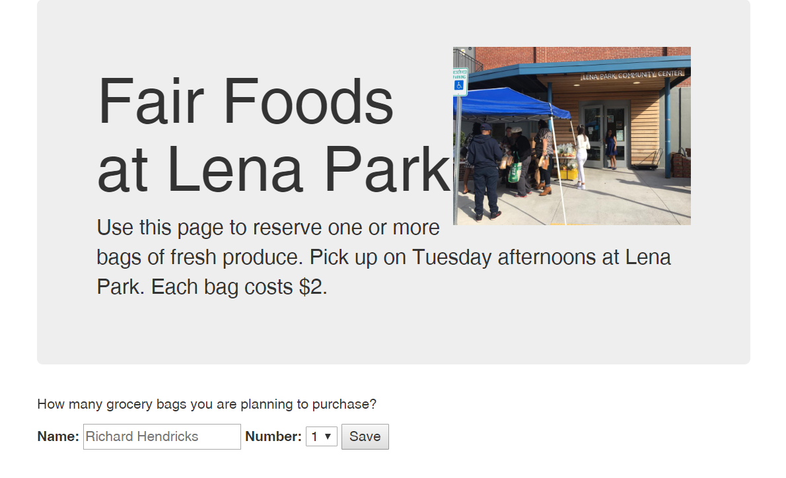
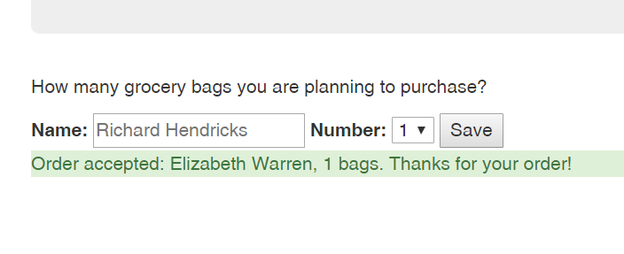

### Creating a Fair Foods reservation system

Every Tuesday, [Fair Foods](http://www.fairfoods.org/index.php?page=food_rescue.htm) brings quality surplus groceries to Lena Park and sells them for $2 per bag. We are going to make an online reservation system to help the organization predict how many bags their customers will buy.

#### Set up your project
If you were building this app for a real customer, as a first step you would probably meet with stakeholders at Lena Park and Fair Foods to understand how they wanted it to work. But for now, let's assume we want the app to look like the mockup above (and attached below).

As a first step, create your local project folder and a new repository linked to GitHub. 

#### Set up a basic web app
Refer back to previous classwork and homework to set up your server file (you can call it index.js or app.js, for example). Here are some things to remember:

* Make sure to initialize `npm` inside your project folder to create a package.json.
* Install `express`, `ejs`, `body-parser` and `mongo`
* Require these packages at the top of your entry point.
* Remember that body-parser will also need two `app.use` statements:  
`app.use(body_parser.json());`
`app.use(body_parser.urlencoded({ extended: true }));`  
* Add a GET route for the app's main page ('/'). As a test, your GET route could send a basic message, e.g. `res.send('Fair Foods Reservation System')`.
* Make sure your app is "listening," and have it write out something in the console like "Fair Foods is listening on port 3000!" Make sure your listen statement is on the last line of your file.
* Test your app by starting the server running and pointing your browser to [localhost:3000](http://localhost:3000/) (or whatever port you chose).

#### Configure app to use Public directory
* Your app will need to access CSS and image files, so you should require the `path` module and create an `app.use` statement to point to the public directory. See Day 4 slides from Unit 19 if you forgot the syntax.
* Create a folder for images and another one for CSS and put them into the `public` folder.

#### Create your app homepage in EJS
Now, let's build the template for the main page of the app.  Here are some tips for laying out this page:

* Create this file in the _views_ folder
* Create the homepage with static HTML at first, to match the mockup
* Link to the [Bootstrap CDN](https://getbootstrap.com/docs/4.5/getting-started/introduction/) CSS library so we can take advantage of its useful predefined classes
* The Bootstrap class `jumbotron` will create the large header.  Inside the jumbotron, you can add paragraphs, h1s, etc. to separate text.
* Your jumbotron should display a title ("Fair Foods at Lena Park") and instructions ("Use this page to reserve one or more bags of fresh produce. Pick up on Tuesday afternoons at Lena Park. Each bag costs $2. Learn more about Fair Foods [here](http://www.fairfoods.org/index.php?page=food_rescue.htm)")
* Put the [FairFoods.jpg](public/images/logos/FairFoods.jpg) image into your jumbotron. How can you make the text on the left line up with the picture on the right?
* Create a form with an `action` and a `method`. The action should be something like `'/order'`. When the user clicks the "Save" button, our app will eventually create a new record with their order. Therefore, what HTTP method should we use for this form?
* You can use the HTML `select` element to create a drop-down box where the user can select the number of grocery bags
* Finally, update the homepage route of your web server to _render_ the new EJS file (`res.render()` instead of `res.send()`). There is no data to send to the file yet, so `res.render()` only needs one argument (which is the EJS filename). Test this out in the browser.

#### Create a POST route for your database & update user data on the web server
1. Add a new POST route to your server, which should follow the same path you used in your form `action` above.
2. Refer back to the lessons on Mongo and Atlas to save your data to a new database called "fairFoods" or similar.
3. Run the app and try adding a name and number of bags.  

Good luck!

#### Bonus 1: Success message
Create a new variable in your entry point called `message`, that starts as an empty string. When the user clicks "Save," the message should be updated to say something like `Order accepted: Elizabeth Warren, 3 bags. Thanks for your order!` Note: this variable must be passed to your EJS file from _index.js_ as part of `res.render()`. You will also need to add EJS script tags to your EJS file. You can use the Bootstrap class `alert-success` for some nice formatting. Here's a mockup:

#### Bonus 2: Create order summary page
Create a second EJS file that displays all the orders entered, and totals them up. This view should be accessed through a separate GET route like `/allOrders` or similar.
